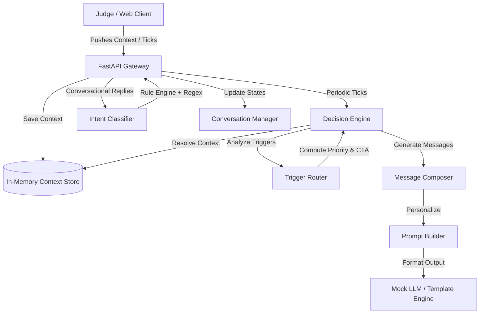
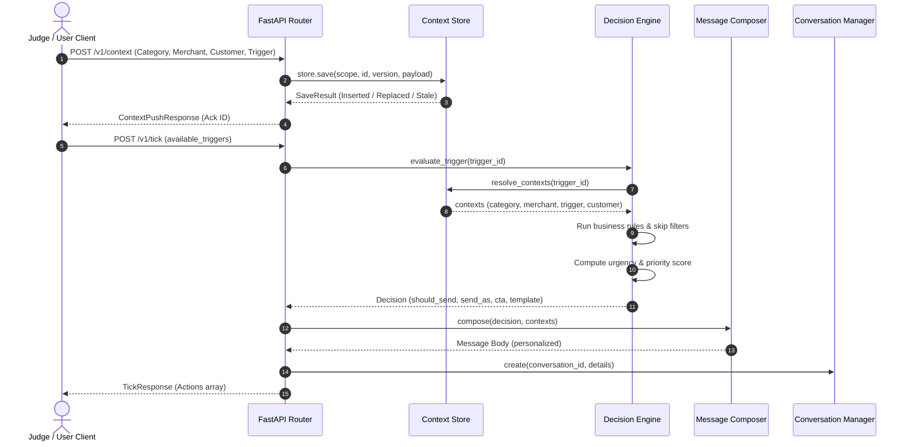
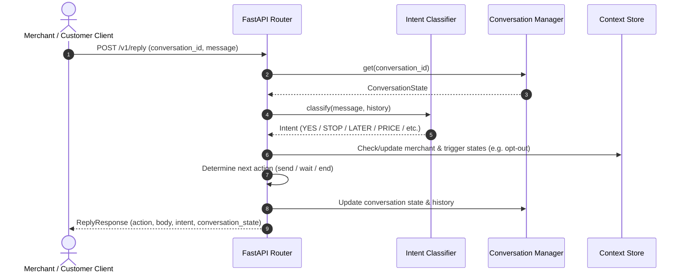

# Vera AI – Intelligent Merchant Engagement Platform

[](https://opensource.org/licenses/MIT)
[](https://www.python.org/)
[](https://fastapi.tiangolo.com/)
[](https://react.dev/)
[](https://tailwindcss.com/)

> Real-time context-aware business intelligence and automated outreach engine for local merchants.

---

## 1. Project Overview

**Vera AI** is a state-of-the-art simulation of Magicpin's merchant outreach assistant, **"Vera"**. Built as a solution for the **Magicpin AI Engineering Challenge**, it demonstrates a deterministic, rule-based reasoning engine that ingests multi-layered contextual datasets (categories, merchants, customers, triggers) to intelligently communicate with local business owners.

The platform executes proactive outreach tasks (such as research summaries, subscription warnings, performance alerts, and customer recall campaigns) and manages complex multi-turn WhatsApp-style conversations with automated intent classification.

* **Backend Gateway**: Python + FastAPI REST API complying strictly with the judge evaluation contract.
* **Frontend Command Center**:
  1. A standalone **React + TypeScript + Tailwind CSS** dashboard (`frontend/`) for deep visual inspection.
  2. A lightweight, **embedded console** (`static/index.html`) served directly by the FastAPI backend at `http://localhost:8080/` for instant zero-dependency testing.

---

## 2. Features

* **Context-Aware AI Conversations**: Composes highly personalized messages by parsing live metrics (CTR, views, batched batches, name anchors).
* **Multi-Layered Context Store**: Versioned, thread-safe, in-memory repository managing categories, merchants, customers, and trigger objects.
* **Trigger-Based Decision Engine**: Evaluates active alerts and applies robust rule filters (e.g., expiry thresholds, consent scopes, performance dip significance) to skip or send outreach actions.
* **Smart Intent Classifier**: Regex-driven natural language classifier supporting English and Hindi (Hinglish) inputs like `YES`, `STOP`, `LATER`, `PRICE`, `DETAILS`, `CALL_ME`, and auto-replies.
* **Dynamic Conversation State Machine**: Manages state transitions (`active` ⇄ `waiting` ⇄ `ended`), turn counts, and auto-reply backoff rates.
* **Interactive Frontend Dashboards**: Live telemetry displays system metrics, loaded contexts, and active API routing lists.
* **Live Chat Simulator & Sandbox**: Developer playground to manually trigger workflows and test chat replies with real-time intent feedback.

---

## 3. System Architecture

### High-Level Architecture


### Backend Request Flow (POST /v1/tick)


### Conversation Reply Flow (POST /v1/reply)


---

## 4. Tech Stack

### Backend
* **Language**: Python 3.11+
* **Framework**: FastAPI (Async router syntax)
* **Validation**: Pydantic v2 (Strict schema enforcement)
* **Server**: Uvicorn (High-performance ASGI server)
* **Testing**: Pytest (Robust unit and route testing)

### Frontend (React App)
* **Build Tool**: Vite (TypeScript configuration)
* **Styling**: Tailwind CSS
* **Components**: shadcn/ui (Radix Primitives)
* **Animations**: Framer Motion
* **Iconography**: Lucide React

---

## 5. Folder Structure

```
magicpin-ai-bot/
├── app/                       # FastAPI Backend Application
│   ├── api/                   # Router endpoints (health, metadata, context, tick, reply)
│   ├── core/                  # Configuration settings, logging, system variables
│   ├── models/                # Pydantic schema declarations
│   ├── services/              # Domain services (decision engine, composer, store, manager)
│   └── utils/                 # General-purpose helper functions and ID generators
├── dataset/                   # Challenge datasets & startup seed data
│   ├── categories/            # 5 predefined category contexts
│   ├── merchants_seed.json    # 10 startup seed merchants
│   ├── customers_seed.json    # 15 startup seed customers
│   └── triggers_seed.json     # 25 startup seed triggers
├── frontend/                  # React Single Page Application (Command Center)
│   ├── src/
│   │   ├── components/        # Interactive UI components
│   │   ├── pages/             # Dashboard, Playground, About pages
│   │   ├── context/           # App-level state context
│   │   └── data/              # Mock layouts and local mock data
│   ├── package.json           # npm configuration
│   └── tailwind.config.js     # styling configurations
├── static/                    # Lightweight embedded HTML console served by FastAPI
├── tests/                     # Test suites (pytest integrations)
├── main.py                    # Gateway app runner
├── requirements.txt           # Python dependency manifest
└── render.yaml                # Render cloud specifications
```

---

## 6. Application Workflow

```
[Select Merchant / Category]
       │
       ▼
[Load Context Store] ────────► [Auto-Seed Categories, Merchants, Customers, Triggers]
       │
       ▼
[Select Trigger ID]
       │
       ▼
[Decision Engine] ──────────► [Check skip conditions, calculate score, assign priority]
       │
       ▼
[Message Composer] ─────────► [Build dynamic prompts, apply names, inject specificity anchors]
       │
       ▼
[Initiate Conversation]
       │
       ▼
[Evaluate User Reply] ──────► [Classify intent via regex, adjust state, return next action]
```

---

## 7. API Documentation

### GET `/v1/healthz`
Returns system status, current server uptime, and count of loaded contexts.

**Sample Response (`200 OK`)**:
```json
{
  "status": "ok",
  "uptime_seconds": 360,
  "contexts_loaded": {
    "category": 5,
    "merchant": 10,
    "customer": 15,
    "trigger": 25
  }
}
```

### GET `/v1/metadata`
Retrieves development information and the engine's logical configuration.

**Sample Response (`200 OK`)**:
```json
{
  "team_name": "Magicpin Challenge",
  "model": "Context Aware Merchant AI",
  "approach": "Rule Engine + Context Store + Mock LLM",
  "version": "1.0.0",
  "contact_email": "example@email.com",
  "environment": "development",
  "architecture": "Clean Architecture (API, Services, Models)",
  "llm_provider": "Mock LLM / Template Composer",
  "storage": "Thread-Safe In-Memory Context Store"
}
```

### POST `/v1/context`
Registers or updates context data with strict Pydantic parsing.

**Sample Request**:
```json
{
  "scope": "category",
  "context_id": "dentists",
  "version": 1,
  "payload": {
    "slug": "dentists",
    "display_name": "Dentists",
    "voice": { "tone": "peer_clinical" },
    "peer_stats": { "avg_ctr": 0.03 }
  },
  "delivered_at": "2026-07-03T20:00:00Z"
}
```

**Sample Response (`200 OK`)**:
```json
{
  "accepted": true,
  "ack_id": "ack_dentists_v1",
  "stored_at": "2026-07-03T20:06:12.345Z"
}
```

### POST `/v1/tick`
Evaluates active triggers to produce proactive outreach messages.

**Sample Request**:
```json
{
  "now": "2026-04-26T10:35:00Z",
  "available_triggers": ["trg_001_research_digest_dentists"]
}
```

**Sample Response (`200 OK`)**:
```json
{
  "actions": [
    {
      "conversation_id": "conv_a3f89e",
      "merchant_id": "m_001_drmeera_dentist_delhi",
      "customer_id": null,
      "send_as": "vera",
      "trigger_id": "trg_001_research_digest_dentists",
      "template_name": "vera_research_digest_v1",
      "template_params": ["Meera", "Dr. Meera, JIDA's latest landed..."],
      "body": "Dr. Meera, JIDA's latest landed. One item relevant for your high_risk_adults patients — 2,100-patient trial: 3-month fluoride recall cuts caries 38% better. Worth a 2-min read. Want me to pull the abstract + draft a patient-ed WhatsApp you can share?",
      "cta": "open_ended",
      "suppression_key": "research:dentists:2026-W17",
      "rationale": "CRITICAL priority research_digest for merchant; Trigger research_digest is actionable for merchant"
    }
  ]
}
```

### POST `/v1/reply`
Ingests user replies to output state transitions and follow-up replies.

**Sample Request**:
```json
{
  "conversation_id": "conv_a3f89e",
  "message": "Yes, please send the abstract",
  "turn_number": 2,
  "received_at": "2026-04-26T10:40:00Z"
}
```

**Sample Response (`200 OK`)**:
```json
{
  "action": "send",
  "body": "Sending the abstract now (PDF, 2 pages). Also drafted a patient-ed WhatsApp below — copy-paste ready:\n\n\"3-month vs 6-month cleaning — new research shows it matters for high-risk patients. Reply to book a quick check.\"\n\nWant me to schedule the Google post for tomorrow 10am?",
  "cta": "open_ended",
  "wait_seconds": null,
  "rationale": "Honoring merchant commitment; switching to action mode.",
  "intent": "DETAILS",
  "conversation_state": "active",
  "turn_number": 2
}
```

### POST `/v1/reset`
Clears active conversations, opted-out states, and suppressions, then re-seeds the store from local datasets.

**Sample Response (`200 OK`)**:
```json
{
  "status": "ok",
  "message": "State reset and re-seeded successfully"
}
```

---

## 8. Frontend Guide

### Dashboard Page
Displays live telemetry charts representing context counts, uptime details, system parameters, and metadata configurations.

### Chat Page (Playground)
Simulates WhatsApp conversations in real time. Demonstrates natural language processing and replies dynamically with intent and state updates showing in the metadata sidebar.

### Merchant Context Panel
Allows debugging and inspecting merchant details, aggregated customer cohorts, subscription parameters, and active business campaigns.

### Trigger Simulator
Provides a list of seed triggers (performance dips, compliance rules, festival footfalls). Developers can manually fire a trigger to view the generated messages instantly.

---

## 9. Getting Started

### Installation

Clone the repository and enter the directory:
```bash
git clone https://github.com/Silambazhagii/VeraAI.git
cd magicpin-ai-bot
```

### Backend Setup
1. Create a virtual environment and install backend requirements:
```bash
python -m venv venv
source venv/bin/activate  # On Windows: venv\Scripts\activate
pip install -r requirements.txt
```
2. Copy the environment template:
```bash
cp .env.example .env
```
3. Run the uvicorn development server:
```bash
uvicorn main:app --reload --host 127.0.0.1 --port 8080
```
Open **[http://localhost:8080/](http://localhost:8080/)** in your browser to view the embedded Command Center.

### Frontend Setup (React App)
1. Navigate to the frontend directory:
```bash
cd frontend
```
2. Install npm dependencies:
```bash
npm install
```
3. Copy environment variables:
```bash
cp .env.example .env
```
4. Start the Vite React development server:
```bash
npm run dev
```
Open **[http://localhost:5173/](http://localhost:5173/)** to access the complete React dashboard.

---

## 10. Deployment

### Backend (Render Deployment)
Vera AI is fully optimized for **[Render](https://render.com/)**:
1. Connect your repository to Render.
2. Select **Web Service** with environment `Python`.
3. Set Build Command: `pip install -r requirements.txt`.
4. Set Start Command: `uvicorn main:app --host 0.0.0.0 --port $PORT`.
5. Add env variables defined in `.env.example`.

### Frontend (Vercel Deployment)
The React client is deployable to **[Vercel](https://vercel.com/)**:
1. Add a new project and import the repository.
2. Set root directory to `frontend`.
3. Framework preset: `Vite`.
4. Add environment variable `VITE_API_URL` pointing to your deployed Render URL.

---

## 11. Screenshots

*(Representational Mockups for UI presentation)*

| Dashboard Page | Chat Simulator |
|---|---|
|  |  |

| Merchant Context Viewer | Trigger Sandbox |
|---|---|
|  |  |

---

## 12. Future Enhancements

* **LLM Integration**: Replacing the mock template composer with a live LLM endpoint (e.g. Gemini, GPT-4) using custom function calling.
* **Production Database**: Implementing PostgreSQL for persistent record-keeping and database migrations.
* **Message Broker & Caching**: Integrating Redis to cache session states and support multi-worker server scales.
* **Real-time WebSockets**: Implementing WebSocket routes to stream telemetry updates and incoming chat replies instantly.
* **Auth Protection**: Securing dashboard routes with OAuth2 and JWT authorizations.

---

## 13. Software Engineering Highlights

* **Clean Architecture**: Adheres strictly to a separated layers model. The `api` endpoints delegate to domain `services` using Pydantic `models`, separating HTTP schemas from business calculations.
* **Event-Driven Workflows**: Integrates a generic `/v1/tick` mechanism that simulates standard cron tasks, driving the evaluation engine on demand.
* **State Preservation & Thread Safety**: Uses strict locks (`threading.RLock`) to ensure the store and session history arrays remain accurate during parallel webhook pushes.
* **High-Precision Intent Classification**: Utilizes weighted multi-regex checks and Hinglish support to accurately identify intent without high-cost latency.

---

## 14. License

Distributed under the MIT License. See [LICENSE](LICENSE) for details.

---

## 15. Author

Developed and Maintained by **Silambazhagii**.

---

## 16. Acknowledgements

This project was developed as a solution for the **Magicpin AI Engineering Challenge**. It is intended strictly for evaluation, testing, and educational purposes. Special thanks to the Magicpin team for formulating a robust evaluation framework.
